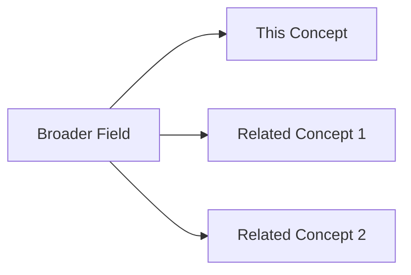
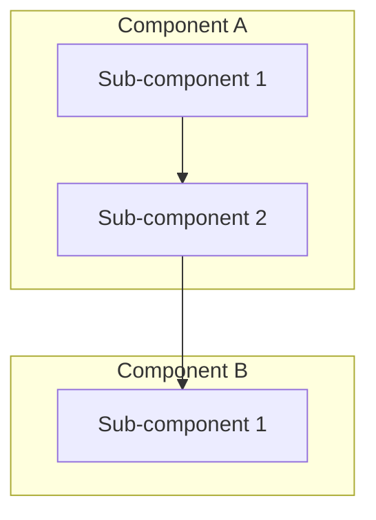
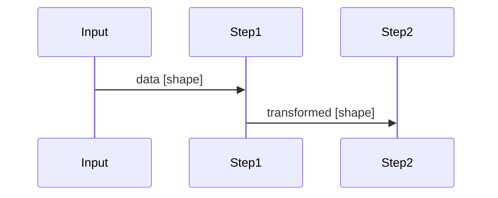
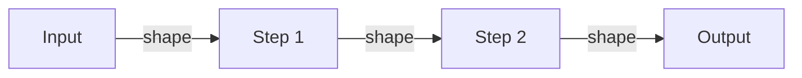
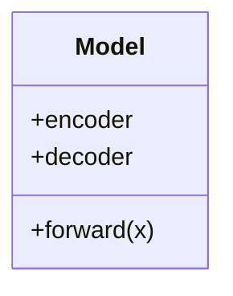

# Output Templates — Each Level's Markdown Structure

## Level 1: Intuition Template

```markdown
# <Concept> — Level 1: Intuition

> **One-line hook**: A simple, memorable sentence capturing the essence.

## The Core Idea

[2-3 paragraphs using the Feynman method. Pure analogy, zero jargon.]

## Real-World Analogy

[Extended analogy with component mapping]

| Concept Component | Real-World Parallel |
|-------------------|---------------------|
| Component A       | Parallel A          |
| Component B       | Parallel B          |

## Why Does This Exist?

[What problem motivated this? What was the gap before this concept existed?]

## Where Does It Fit?

[Brief landscape — what family does this belong to? What are its siblings?]



## Key Takeaways
- Takeaway 1
- Takeaway 2
- Takeaway 3

## Checkpoint Questions
1. In your own words, why does <concept> exist?
2. How does the analogy break down for [edge case]?
3. Name one real-world application of <concept>.
```

---

## Level 2: Overview Template

```markdown
# <Concept> — Level 2: Overview

> **One-line summary**: The architecture and components at a glance.

## Architecture



## Components Breakdown

### Component A: [Name]
[What it does, why it exists, key properties]

### Component B: [Name]
[What it does, why it exists, key properties]

## How Components Interact

[Describe the flow between components]

## Landscape: Where This Fits

| Approach | Key Difference | When to Use |
|----------|---------------|-------------|
| This concept | ... | ... |
| Alternative 1 | ... | ... |
| Alternative 2 | ... | ... |

## Key Takeaways
- Takeaway 1
- Takeaway 2

## Checkpoint Questions
1. What are the main components of <concept>?
2. What would happen if [component] were removed?
3. When would you choose <concept> over [alternative]?
```

---

## Level 3: Walkthrough Template

```markdown
# <Concept> — Level 3: Step-by-Step Walkthrough

> **One-line summary**: Tracing through a concrete example end to end.

## Setup

[Define the specific example: input data, dimensions, parameters]

**Example input**: [Concrete values]

## Step-by-Step Trace

### Step 1: [Name]

**Input**: [exact values/shapes]

[Explanation of what happens]

**Output**: [exact values/shapes]



### Step 2: [Name]
[Continue for each step...]

## Full Pipeline Visualization



## What Happens With Different Inputs?

[Show 2-3 variations to build intuition about behavior]

## Key Takeaways
- Takeaway 1
- Takeaway 2

## Checkpoint Questions
1. What would the output be if [different input]?
2. At which step does [specific transformation] happen?
3. Predict the output shape at step N.
```

---

## Level 4: Mathematics Template

```markdown
# <Concept> — Level 4: Mathematics

> **One-line summary**: The formal mathematical foundation.

## Prerequisites

[List mathematical prerequisites: linear algebra, calculus, probability, etc.]

## Notation

| Symbol | Meaning |
|--------|---------|
| $x$    | Input   |
| $z$    | Latent  |
| ...    | ...     |

## Core Formulation

### The Problem Statement

[State mathematically what we're trying to achieve]

$$\min_\theta \mathcal{L}(\theta) = ...$$

### Derivation

**Step 1**: [Starting point]
$$equation$$

**Step 2**: [Transformation with explanation]
$$equation$$

[Continue step by step...]

### Connecting Math to Intuition

[Explicitly connect each mathematical term back to the Level 1 analogy]

- The term $...$ corresponds to [intuitive concept]
- Minimizing $...$ means [plain English]

## Important Properties

### Property 1: [Name]
[Statement and brief proof/justification]

### Property 2: [Name]
[Statement and brief proof/justification]

## Common Variations

| Variation | Mathematical Change | Effect |
|-----------|-------------------|--------|
| Variation 1 | $\mathcal{L} += ...$ | ... |
| Variation 2 | ... | ... |

## Key Takeaways
- Takeaway 1
- Takeaway 2

## Checkpoint Questions
1. What does each term in the loss function represent intuitively?
2. What happens to the gradient when [condition]?
3. Derive [variation] from the base formulation.
```

---

## Level 5: Code (High-Level) Template

```markdown
# <Concept> — Level 5: Code (High-Level Implementation)

> **One-line summary**: Building <concept> using PyTorch/sklearn.

## Approach

[Brief explanation of the implementation strategy using existing frameworks]

## Code Structure



## Implementation

See: `code/01_<concept>_highlevel.py`

### Key Sections Explained

#### Section 1: [Model Definition]
[Explain what the code does and why, referencing specific line ranges]

#### Section 2: [Training Loop]
[Explain the training process]

#### Section 3: [Evaluation]
[Explain how to evaluate results]

## Running the Code

```bash
pip install torch numpy matplotlib
python code/01_<concept>_highlevel.py
```

## Expected Output

[Show expected console output or describe expected results]

## Key Takeaways
- Takeaway 1
- Takeaway 2

## Checkpoint Questions
1. What would happen if you changed [hyperparameter]?
2. How would you modify this for [variation]?
3. Which PyTorch module handles [specific task]?
```

---

## Level 6: Code (From Scratch) Template

```markdown
# <Concept> — Level 6: Code (From Scratch)

> **One-line summary**: Rebuilding <concept> from NumPy to understand the internals.

## What We're Building

[Explain what we'll implement manually and what this reveals]

## What the Frameworks Hide

| Framework Call | What Actually Happens |
|---------------|----------------------|
| `nn.Linear(a, b)` | Weight matrix multiplication + bias |
| `loss.backward()` | Chain rule through computation graph |
| ... | ... |

## Implementation

See: `code/02_<concept>_from_scratch.py`

### Key Sections Explained

#### Section 1: [Core Component]
[Deep explanation of the manual implementation]

#### Section 2: [Forward Pass]
[Explain the mathematics being computed]

#### Section 3: [Backward Pass / Training]
[Explain gradient computation step by step]

## Comparing High-Level vs From Scratch

| Aspect | PyTorch Version | From Scratch |
|--------|----------------|--------------|
| Lines of code | ~X | ~Y |
| Training speed | Fast (GPU) | Slow (CPU) |
| Understanding gained | Architecture | Mechanics |

## Key Takeaways
- Takeaway 1
- Takeaway 2

## Checkpoint Questions
1. Implement [missing component] without looking at the code.
2. Why do we [specific implementation detail]?
3. What would break if we removed [specific line]?
```

---

## Level 7: Teach Notes Template

```markdown
# <Concept> — Level 7: Teaching Notes (IIT Level)

> **One-line summary**: Ready-to-use teaching materials for IIT students.

## Suggested Teaching Flow (50-minute lecture)

| Time | Topic | Activity |
|------|-------|----------|
| 0-5 min | Hook & motivation | Analogy from L1 |
| 5-15 min | Architecture overview | Diagram from L2 |
| 15-25 min | Walkthrough | Example from L3 |
| 25-35 min | Math foundations | Derivation from L4 |
| 35-45 min | Live coding | Code from L5 |
| 45-50 min | Q&A + preview | Tease next topic |

## Whiteboard Plan

[Key diagrams and equations to draw on the board, in order]

## Common Student Misconceptions

| Misconception | Why Students Think This | Correct Understanding |
|--------------|------------------------|----------------------|
| Misconception 1 | ... | ... |
| Misconception 2 | ... | ... |

## Discussion Prompts

1. [Open-ended question to spark discussion]
2. [Question comparing this concept to a related one]
3. [Question about real-world applications]

## Exam-Worthy Questions

### Short Answer
1. [Question] (Expected: 2-3 sentences)
2. [Question] (Expected: 2-3 sentences)

### Long Answer
1. [Question requiring derivation or detailed explanation]
2. [Question requiring code or pseudocode]

### Coding Assignment
[A take-home assignment building on the concept]

## Further Reading
- [Paper/resource 1 with link]
- [Paper/resource 2 with link]
- [Tutorial/resource 3 with link]
```
